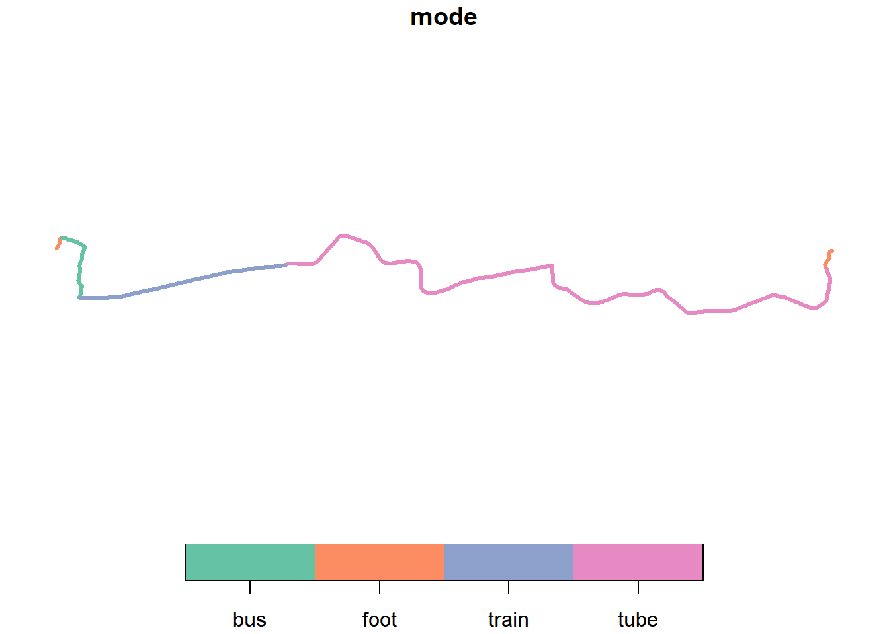
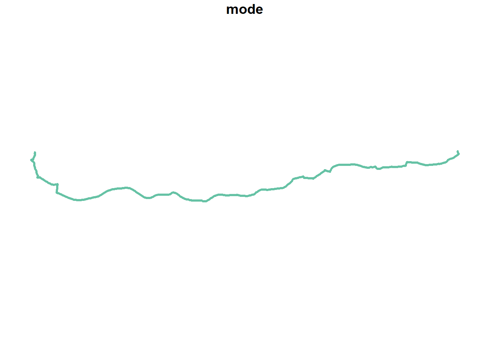

[](https://ci.appveyor.com/project/robinlovelace/transportAPI)

<!-- README.md is generated from README.Rmd. Please edit that file -->
transportAPI
============

The goal of transportAPI is to provide a simple R interface to the transportAPI.net routing service.

It was split-out from **stplanr** for modularity.

Currently only the jounrney planner APIs are supported.

Installation
------------

<!-- You can install the released version of transportAPI from [CRAN](https://CRAN.R-project.org) with: -->
Install the package with **devtools** as follows:

``` r
# install.packages("devtools")
devtools::install_github("mem48/transportAPI")
```

Example
-------

A common need is to get from A to B:

``` r
library(transportAPI)
library(sf)
#> Warning: package 'sf' was built under R version 3.4.4
#> Linking to GEOS 3.6.1, GDAL 2.2.3, proj.4 4.9.3
library(dplyr)
#> Warning: package 'dplyr' was built under R version 3.4.2
#> 
#> Attaching package: 'dplyr'
#> The following objects are masked from 'package:stats':
#> 
#>     filter, lag
#> The following objects are masked from 'package:base':
#> 
#>     intersect, setdiff, setequal, union
from = c(-0.432, 51.52)
to = c(0.012, 51.52)
r.public = transportAPI::journey(from, to, base_url = "http://fcc.transportapi.com/")
sf:::plot.sf(r.public[r.public$route_option == 1,"mode"], lwd = 3)
```



``` r
r.car = transportAPI::journey(from, to, base_url = "http://fcc.transportapi.com/", apitype = "car")
sf:::plot.sf(r.car[,"mode"], lwd = 3)
```



To get a key go to <https://developer.transportapi.com/>

Save the key as an environment varible using `export TRANSPORTAPI_app_id=your_id_here` by adding `TRANSPORTAPI_app_id=your_id_here` as a new line in your `.Renviron` file and `TRANSPORTAPI_app_key=your_key_here`, e.g. with the following command:

``` r
usethis::edit_r_environ()
```

Route types available are: public, car, cycle See help pages such as `?journey` and <https://developer.transportapi.com/> for details.
